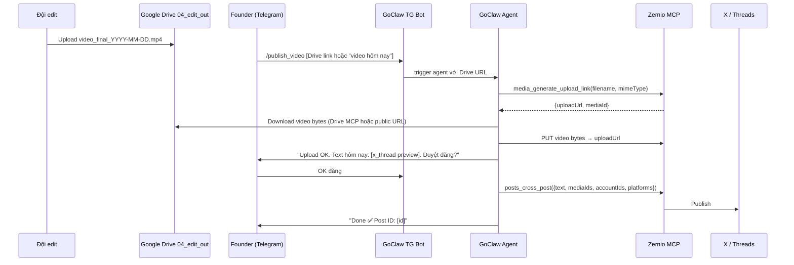

# A5 — Media Flows Runbook (Alpha Trading Lab)

> **Phase:** A5 (ảnh AI + Drive + Video)  
> **Bắt đầu:** Sau A2 (E2E text publish Done 2026-05-21)  
> **Audit status:** [`PILOT_ALPHA_AUDIT_STATUS.md`](./PILOT_ALPHA_AUDIT_STATUS.md)  
> **Skill:** [`goclaw-export/skills/alpha-content-writer/SKILL.md`](./goclaw-export/skills/alpha-content-writer/SKILL.md) v1.5.0 — step 5 A5 tham chiếu mục **Tiêu chuẩn ảnh** bên dưới  
> **Cập nhật:** 2026-05-20

---

## Tiêu chuẩn ảnh + đặt tên (SSOT)

> **Áp dụng:** Team Founder/edit, F1/F2 trước khi upload Zernio, và skill `alpha-content-writer` (bước 5 A5).  
> **Drive kho ảnh pilot:** [Alpha Media — folder ảnh](https://drive.google.com/drive/folders/1IW_UN4hnezRWvF3RSNMmaUXcf9pdzwbv)  
> **Lưu ý:** Drive = thư viện; **đăng được** khi file đã chuẩn hóa và có `mediaId` từ Zernio Media Library (hoặc upload MCP thành công).

### Một lệnh (Windows) — đã chạy cho folder `hinh`

Từ root repo:

```powershell
.\scripts\alpha-media-prep.ps1
```

Script mặc định **`-Mode preserve`**: giữ **toàn bộ khung ảnh** (chart không bị cắt) · chỉ resize nếu cạnh dài &gt;1920px · JPG · đặt tên trong `01_ready_jpg/full/` · **cùng 1 file** dùng cho X + Threads.

| Mode | Khi nào dùng |
|------|----------------|
| **`preserve`** (mặc định) | Chart/brief — **không cắt** nội dung |
| `letterbox` | Cần khung 16:9 / 1:1 nhưng vẫn thấy hết ảnh (viền tối) |
| `crop` | Tránh — cắt mất ~1/3 chart |

```powershell
.\scripts\alpha-media-prep.ps1 -Mode letterbox   # chỉ khi cần khung cố định
```

Thư mục `x_16x9/` / `threads_1x1/` từ lần chạy crop cũ: **không dùng** — dùng `full/`.

**Sau script (2 việc tay):**

1. Kéo nội dung `01_ready_jpg/` lên Drive folder pilot (subfolder `01_ready_jpg` trên Drive).
2. Zernio → Media → upload file **hero** (xem `manifest.json` → `recommendedHero`) → copy **mediaId** → GoClaw đăng.

Rebuild skill ZIP (khi sửa SKILL.md):

```powershell
.\scripts\rebuild-alpha-content-writer-zip.ps1
```

→ Upload `docs/goclaw-export/skills/zips/alpha-content-writer.zip` lên GoClaw → Rescan.

### Quy trình 2 bước (bắt buộc trước khi vào Drive `01_ready_jpg/`)

```text
[Raw] ảnh gốc (AI, phone, screenshot)
    ↓ ① Chuẩn hóa — JPG/PNG, resize, ≤5 MB, đúng tỷ lệ kênh
    ↓ ② Đổi tên — alpha_{platform}_{aspect}_{date}_{slug}.jpg
    ↓ ③ Upload Zernio Media (ưu tiên) hoặc kéo vào Drive ready → lấy FILE_ID / mediaId
```

### Bảng tiêu chuẩn kỹ thuật

| Hạng mục | Chuẩn (PASS) | FAIL / tránh |
|----------|----------------|--------------|
| **Định dạng** | `.jpg` / `.jpeg` (ưu tiên) hoặc `.png` | `.webp`, `.heic`, `.gif`, `.bmp`, `.tiff`, không đuôi |
| **MIME (upload Zernio)** | `image/jpeg` hoặc `image/png` | `application/octet-stream`, sai `Content-Type` khi PUT |
| **Dung lượng** | ≤ **5 MB** | File 10–20 MB từ máy ảnh / export AI |
| **Pixel** | Cạnh ngắn ≥ **1080 px** | &lt; 600 px |
| **Tỷ lệ X** | **16:9** — vd. 1920×1080, 1280×720 | Portrait hẹp, crop méo chữ |
| **Tỷ lệ Threads** | **1:1** (1080×1080) hoặc **4:5** (1080×1350) | Dùng ảnh 16:9 cho Threads khi platform báo lỗi format |
| **Màu** | sRGB, 8-bit | CMYK (file in ấn) |
| **Nội dung** | Không text overlay lỗi font từ AI | Meme, font vỡ |
| **Drive (agent tải FILE_ID)** | **Từng file** share *Anyone with the link* → Viewer | Chỉ share folder; file private → curl tải về HTML → Zernio **unsupported format** |
| **Sau publish** | Zernio dashboard = **Published** | Báo “Done” khi status **Failed** (X &gt;280 ký tự, ảnh lỗi) |

**Ảnh chart/brief có sẵn:** 1 file `full/` (preserve) — đủ thông tin, đăng cả X + Threads.

**Hai ảnh AI riêng (tùy chọn):** `img_1` 16:9 · `img_2` 1:1 trong `image_prompts` — chỉ khi gen mới từ prompt, không bắt buộc crop ảnh gốc.

### Quy ước đặt tên file

```
alpha_{platform}_{aspect}_{YYYY-MM-DD}_{slug}.jpg
```

| Thành phần | Giá trị |
|------------|--------|
| `platform` | `x` · `threads` · `both` (chỉ khi 1 ảnh dùng chung có chủ đích) |
| `aspect` | `16x9` · `1x1` · `4x5` |
| `date` | `2026-05-21` (ngày brief / ngày đăng dự kiến) |
| `slug` | `liquidity-sweep`, `fvg-chart`, `daily-brief` — không dấu, không space |

**Ví dụ:**

- `alpha_x_16x9_2026-05-21_liquidity-sweep.jpg`
- `alpha_threads_1x1_2026-05-21_fvg-chart.jpg`

### Cấu trúc trong folder Drive pilot

Tạo subfolder trong [folder ảnh pilot](https://drive.google.com/drive/folders/1IW_UN4hnezRWvF3RSNMmaUXcf9pdzwbv):

```text
1IW_UN4hnezRWvF3RSNMmaUXcf9pdzwbv/   ← link SSOT ở trên
  00_inbox/          ← ảnh thô, chưa xử
  01_ready_jpg/      ← đã chuẩn hóa + đặt tên — chỉ file PASS bảng trên
  02_posted/         ← đã dùng (kéo vào sau publish OK trên Zernio)
```

Song song cấu trúc tuần (video / brief): xem **FLOW 3 → Cấu trúc Drive chuẩn** (`Alpha_Media/YYYY-Wxx/`).

### Chuẩn hóa nhanh (Windows)

1. Mở ảnh → **Save as JPEG** (quality 85–90) hoặc PNG nếu cần trong suốt.
2. Resize: **X** → 1280×720 hoặc 1920×1080 · **Threads** → 1080×1080.
3. Đổi tên theo quy ước → đặt vào `01_ready_jpg/`.
4. **Zernio** → Media → Upload → copy **mediaId** (pilot ưu tiên, ổn định hơn Drive+curl).
5. Share **từng file** “Anyone with link” chỉ khi dùng F1 Option B (agent + `FILE_ID`).

> Đổi tên / crop thủ công: chỉ khi không chạy được `alpha-media-prep.ps1` — xem script trong [`scripts/alpha-media-prep.ps1`](../scripts/alpha-media-prep.ps1).

### Checklist 30 giây (trước khi gửi agent / đăng)

- [ ] Đuôi `.jpg` hoặc `.png`; mở được trên máy
- [ ] ≤ 5 MB; cạnh ngắn ≥ 1080 px
- [ ] Đúng kênh (16:9 X / 1:1 Threads) hoặc 2 file riêng
- [ ] Zernio Media upload OK → có **mediaId**
- [ ] Text: X tweet 1 ≤ **280** ký tự; Threads `threads_post` ≤ **500**
- [ ] Dashboard Zernio: **Published** (không Failed)

---

## Tổng quan 3 flows

| Flow | Tên | Source ảnh/video | Bắt đầu khi |
|------|-----|------------------|------------|
| **F1** | Drive image → Zernio | Ảnh có sẵn trên Google Drive | Agent có Drive MCP hoặc Founder upload tay |
| **F2** | Gemini gen 2 prompt → Zernio | Gemini/Imagen qua GoClaw agent | JSON pack đã có `image_prompts` |
| **F3** | Video edit → Drive → Telegram → publish | Video mp4 đội edit → Drive `04_edit_out` | Drive MCP + TG bot connected |

**Ưu tiên thực tế:**
```
F2 (prompt) → Founder upload tay → mediaId → F1-thủ công → F3 (sau Drive MCP)
```

---

## FLOW 1 — Post có ảnh từ Google Drive

> Ảnh phải **PASS** mục [Tiêu chuẩn ảnh + đặt tên](#tiêu-chuẩn-ảnh--đặt-tên-ssot) trước khi upload Zernio hoặc đưa agent `FILE_ID`.

### Tổng thể

```
Drive image (public/private)
    ↓
Zernio Media Library (pre-signed upload)
    ↓ mediaId
posts_cross_post {text, mediaIds, accountIds}
    ↓
X (@AlphaTrading79) + Threads (@alphatrading.lab)
```

### Option A — Thủ công (không cần MCP Drive) ✅ Dùng ngay

1. Founder mở [Zernio dashboard](https://zernio.com) → **Media** → **Upload**
2. Upload ảnh từ Drive (download trước, upload lên Zernio)
3. Copy **mediaId** từ Zernio Media Library
4. Trong GoClaw chat, nhắn agent:
   ```
   Đăng bài X + Threads với ảnh mediaId: [MEDIA_ID]
   Text: [nội dung x_thread hôm nay]
   ```
5. Agent gọi `mcp_zernio__posts_cross_post` với `mediaIds: ["[MEDIA_ID]"]`

### Option B — Agent tự upload (cần public Drive link)

**Prerequisite:** Ảnh Drive phải được share "Anyone with link" → Viewer

1. Founder right-click file Drive → **Share** → "Anyone with link"
2. Copy file ID từ URL: `https://drive.google.com/file/d/**{FILE_ID}**/view`
3. Direct download URL: `https://drive.google.com/uc?export=download&id={FILE_ID}`
4. Nhắn agent:
   ```
   Đăng ảnh từ Drive file ID: {FILE_ID}
   Text: [nội dung]
   ```
5. Agent sequence:
   - Gọi `mcp_zernio__media_generate_upload_link` → nhận `uploadUrl` + `mediaId`
   - Tải bytes từ Drive URL + PUT lên `uploadUrl` (cần GoClaw `http_request` tool)
   - Gọi `posts_cross_post` với `mediaIds`

> **Giới hạn:** GoClaw container cần có `http_request` tool có thể PUT binary. Nếu không, dùng Option A.

### Option C — Google Drive MCP trong GoClaw (đầy đủ nhất, cần setup)

**Setup 1 lần:**
1. GoClaw → Settings → MCP Servers → **+ Add MCP**
2. URL: `https://mcp.googleapis.com/mcp` hoặc cài `@modelcontextprotocol/server-gdrive` trên VPS
3. Grant cho Alpha Content Writer agent
4. Auth Google account (Drive scope)

**Sau khi setup:**
- Agent đọc Drive file ID → lấy bytes → upload Zernio → post

> **Ưu tiên:** Setup Option C sau khi F1 thủ công ổn định 3 ngày.

---

## FLOW 2 — Gemini tạo ảnh (2 prompt)

### Concept

Alpha Content Writer tạo 2 `image_prompts` trong JSON → Founder/GoClaw Gemini agent gen ảnh → upload Zernio → post với mediaIds.

### Bước 1 — Alpha agent sinh image prompts

Trong JSON output (field mới `image_prompts`):

```json
{
  "telegram_brief": "...",
  "x_thread": "...",
  "threads_post": "...",
  "youtube_pack": {...},
  "image_prompts": [
    {
      "id": "img_1",
      "use": "X thread header",
      "prompt": "Cinematic gold bars on dark trading floor, Bloomberg terminal glow, institutional atmosphere. Photorealistic. 16:9. No text overlay.",
      "style": "photorealistic, dark moody, institutional trading"
    },
    {
      "id": "img_2",
      "use": "Threads standalone",
      "prompt": "Abstract XAUUSD price chart forming upward channel, liquidity sweep visual, smart money flow arrows. Dark background, gold accent. 1:1 square.",
      "style": "digital art, dark, gold/amber palette"
    }
  ]
}
```

### Bước 2 — GoClaw Gemini agent generate

**Option A — GoClaw agent Gemini Image:**
1. Trong GoClaw → tạo hoặc mở agent có model **Gemini 2.0 Flash** (có image generation)
2. Paste prompt vào chat agent Gemini:
   ```
   Generate image: [prompt từ image_prompts[0].prompt]
   Style: [style]
   Output: 1 image, download URL
   ```
3. Agent Gemini trả về ảnh → download → upload Zernio Media

**Option B — Google AI Studio (ngoài GoClaw):**
1. Mở [aistudio.google.com](https://aistudio.google.com)
2. Chọn model `imagen-3.0-generate-002` hoặc `gemini-2.0-flash-exp-image-generation`
3. Paste prompt → Generate
4. Download PNG → upload Zernio Media → copy mediaId

**Option C — OpenAI gpt-image-2 (A5/P4):**
```
Endpoint: POST https://api.openai.com/v1/images/generations
{
  "model": "gpt-image-2",
  "prompt": "[image_prompts[0].prompt]",
  "n": 1,
  "size": "1024x1024"
}
```
→ Download URL → upload Zernio → mediaId

### Bước 3 — Upload lên Zernio + post

Sau khi có ảnh file hoặc URL:

```
Founder → Zernio Media Library → Upload → copy mediaId
Nói với agent: "mediaId cho img_1: [id1], img_2: [id2]. Đăng bài hôm nay."
Agent → posts_cross_post với mediaIds: [id1, id2]
```

### Prompt quality guidelines

| Element | Khuyến nghị | Tránh |
|---------|------------|-------|
| Subject | Gold bars, chart patterns, trading desk | Meme, cartoon |
| Style | Photorealistic / cinematic, dark moody | Bright, colorful |
| Aspect ratio | 16:9 (X), 1:1 (Threads) | Portrait |
| Text overlay | "No text overlay" hoặc để agent thêm | Text bị lỗi font |
| Brand cue | "institutional trading atmosphere" | Consumer / retail |

---

## FLOW 3 — Video đội edit → Drive → Telegram → publish

### Sequence đầy đủ



### Setup cần làm (1 lần)

#### 1. Telegram bot kết nối GoClaw Alpha agent

1. GoClaw → Alpha Content Writer → **Channels** → **+ Add Channel**
2. Chọn **Telegram** → cấu hình bot token (bot Telegram admin)
3. Test: nhắn `/start` vào bot → agent trả lời

#### 2. Lệnh Telegram admin nhận biết

Thêm vào SKILL.md hoặc System Prompt của agent:

```
Khi nhận lệnh "/publish_video [URL_hoặc_file_ID]":
1. Parse Drive file ID từ URL
2. Lấy upload URL từ Zernio MCP: media_generate_upload_link
3. Download + upload video
4. Hỏi admin: "Video sẵn sàng. Dùng text hôm nay hay text mới?"
5. CHỈ post khi admin OK
```

#### 3. Cấu trúc Drive chuẩn

```
Alpha_Media/
  2026-W21/
    01_brief/           ← JSON pack từ agent
    02_ai_images/       ← ảnh Gemini/OpenAI
    03_edit_in/         ← file thô đội edit nhận
    04_edit_out/        ← video final đội edit gửi vào đây
    05_publish_done/    ← screenshot + link đã đăng
```

Đội edit đặt tên file: `alpha_xauusd_YYYY-MM-DD.mp4`

### Fallback (chưa có Drive MCP)

Nếu Drive MCP chưa cài:

1. Đội edit upload video lên Drive `04_edit_out`
2. Founder share file "Anyone with link" → copy direct download URL
3. Nhắn bot: `/publish_video https://drive.google.com/uc?export=download&id={FILE_ID}`
4. Agent dùng URL này để upload Zernio

---

## Ma trận phụ thuộc (dependency map)

| Flow | Cần ngay | Cần setup thêm |
|------|----------|---------------|
| F1 Option A (tay) | ✅ Không cần | — |
| F1 Option B (public Drive) | GoClaw `http_request` binary PUT | Founder share "Anyone" |
| F1 Option C (Drive MCP) | Google Drive MCP trên GoClaw | Auth Google |
| F2 Gemini prompt | ✅ Alpha agent gen prompts | Founder gen ảnh tay hoặc AI Studio |
| F2 full auto | Google Imagen MCP hoặc OpenAI | API key config |
| F3 Telegram trigger | Telegram bot kết nối GoClaw | Setup 1 lần |
| F3 video upload | Drive MCP hoặc public URL | Tùy option |

---

## Checklist A5 (đóng phase)

- [ ] **F1** Ít nhất 1 post có ảnh từ Drive → X + Threads live
- [ ] **F2** Alpha agent sinh `image_prompts` trong JSON → 1 ảnh gen → post live
- [ ] **F3** Telegram command trigger → video upload Zernio → post live
- [ ] Drive folder structure `Alpha_Media/YYYY-Wxx/` confirmed
- [ ] Drive pilot `00_inbox` / `01_ready_jpg` / `02_posted` + quy ước tên `alpha_*`
- [ ] Ít nhất 1 ảnh PASS tiêu chuẩn SSOT (JPG/PNG ≤5MB) → Zernio mediaId
- [ ] Đội edit biết quy ước đặt tên + thư mục `04_edit_out`

---

## Link nhanh

| Tài liệu | Path |
|----------|------|
| Pilot audit | [`PILOT_ALPHA_AUDIT_STATUS.md`](./PILOT_ALPHA_AUDIT_STATUS.md) |
| Media workflow diagram | [`ALPHA_MEDIA_WORKFLOW.md`](./ALPHA_MEDIA_WORKFLOW.md) |
| Skill v1.5.0 | [`goclaw-export/skills/alpha-content-writer/SKILL.md`](./goclaw-export/skills/alpha-content-writer/SKILL.md) |
| Drive ảnh pilot (SSOT) | https://drive.google.com/drive/folders/1IW_UN4hnezRWvF3RSNMmaUXcf9pdzwbv |
| Script prep ảnh | [`scripts/alpha-media-prep.ps1`](../scripts/alpha-media-prep.ps1) |
| Skill ZIP rebuild | [`scripts/rebuild-alpha-content-writer-zip.ps1`](../scripts/rebuild-alpha-content-writer-zip.ps1) |
| Zernio MCP docs | https://docs.zernio.com/resources/mcp |
| Google Drive MCP | https://github.com/modelcontextprotocol/servers/tree/main/src/gdrive |
