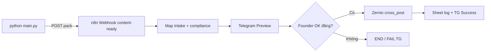

# Alpha Factory — Hướng dẫn từng bước

> **Mục tiêu:** Chạy pipeline **Layer 1 (Python)** → **Layer 2 (n8n mỏng, không LLM)** → **Layer 3 (Zernio X + Threads)**.  
> **Không** dùng Claude Writer trong n8n — tránh mỗi tin Telegram kích hoạt lại LLM.

| Thành phần | Path |
|------------|------|
| Factory (Python) | `services/alpha-factory/` |
| Webhook workflow | `workflows/alpha-m0.webhook-intake.json` |
| Schema pack | `config/n8n/schemas/alpha-content-pack.schema.json` |
| Brand / account IDs | `config/n8n/brands.json` |
| Zernio HTTP | `docs/ZERNIO_N8N_HTTP_PUBLISH.md` |
| Keys n8n | `docs/N8N_ALPHA_KEYS_SETUP.md` |

---

## Tổng quan luồng



---

## Phần A — Điều kiện trước khi bắt đầu

### A1. Tài khoản & quyền

- [ ] **Anthropic API key** (credit đủ cho Haiku)
- [ ] **n8n** (cloud hoặc self-host) — import workflow được
- [ ] **Telegram bot** (@BotFather) + **chat id** admin (Founder)
- [ ] **Zernio** — API key + đã kết nối X `@AlphaTrading79` và Threads `@alphatrading.lab` (P7 Done)
- [ ] (Tuỳ chọn) **Google Sheet** cho log — Phase 4
- [ ] (Tuỳ chọn) **NewsAPI** key — thêm headline

### A2. Đọc nhanh (5 phút)

1. `docs/N8N_HYBRID_V2_BUILD_PLAN.md` — vì sao factory **off** n8n  
2. `docs/ZERNIO_N8N_HTTP_PUBLISH.md` — body Zernio **đúng** (`content`, `platforms`, `publishNow`)  
3. `config/n8n/brands.json` — `twitter` / `threads` `accountId` cho brand `alpha`

---

## Phần B — Cài Alpha Factory (máy local / VPS / Cowork)

### B1. Clone repo & vào thư mục

```powershell
cd "G:\Other computers\My Computer\Project\GAI_AGENTS-lungmat_agent\services\alpha-factory"
```

### B2. Python 3.11+

```powershell
python --version
python -m venv .venv
.\.venv\Scripts\Activate.ps1
pip install -r requirements.txt
```

### B3. File `.env`

```powershell
copy .env.example .env
```

Sửa `.env`:

| Biến | Ví dụ | Bắt buộc |
|------|--------|----------|
| `ANTHROPIC_API_KEY` | `sk-ant-...` | Có |
| `ANTHROPIC_MODEL` | `claude-haiku-4-5-20251001` | Khuyên giữ |
| `N8N_WEBHOOK_URL` | URL sau Bước C4 | Có khi chạy thật |
| `NEWS_API_KEY` | từ newsapi.org | Không |
| `TOPIC` | chủ đề ngày | Không |
| `BRAND_ID` | `alpha` | Không |

**Chưa có webhook URL:** chạy dry-run trước (Bước B5).

### B4. Dry-run (không gọi n8n)

```powershell
python main.py --dry-run
```

**Kỳ vọng:**

- Console: số headline RSS (0–8 đều OK)
- File: `output/alpha/alpha-YYYY-MM-DD-HHMM-xxxx.pack.json`
- `compliance.status` = `PASS` — nếu `FAIL`, mở pack JSON, sửa prompt hoặc chạy lại

**Lỗi thường gặp:**

| Triệu chứng | Cách xử lý |
|-------------|------------|
| `ANTHROPIC_API_KEY missing` | Điền `.env`, activate venv |
| `No JSON object in model response` | Chạy lại; kiểm tra `prompts/alpha_writer.md` |
| `FAIL compliance` | Tweet >280 hoặc có URL — chạy lại hoặc chỉnh pack tay rồi test webhook tay (C6) |

### B5. Chạy thật (sau khi có webhook)

```powershell
python main.py
```

POST body gửi n8n:

```json
{
  "brand": "alpha",
  "run_id": "alpha-2026-05-20-0830-a1b2",
  "pack": { "...": "full alpha-content-pack" }
}
```

---

## Phần C — n8n: import workflow webhook

### C1. Import

1. n8n → **Workflows** → **Import from file**
2. Chọn: `workflows/alpha-m0.webhook-intake.json`
3. Đặt tên: `Alpha M0 — Webhook Intake (no Writer)`

**Không** dùng `workflows/alpha-m0.template.json` cho production (có node Claude Writer).

### C2. Biến môi trường n8n

Theo `docs/N8N_ALPHA_KEYS_SETUP.md`:

| Tên | Giá trị |
|-----|---------|
| `ZERNIO_API_KEY` | Bearer token Zernio |
| `ZERNIO_API_BASE` | `https://zernio.com/api/v1` |
| `N8N_TELEGRAM_ADMIN_CHAT_ID` | số chat (âm nếu group) |
| `N8N_MEDIA_SHEET_ID` | (khi bật Sheet) |

Workflow webhook **không** cần `ANTHROPIC_API_KEY` trên n8n.

### C3. Credential Telegram

1. Credentials → **Telegram API** → token BotFather  
2. Gắn vào node **Telegram Preview**, **Telegram Success**, **Telegram FAIL** (nếu có)  
3. Chat ID: `{{ $env.N8N_TELEGRAM_ADMIN_CHAT_ID }}`

### C4. Lấy Webhook URL

1. Mở node **Webhook** (`content-ready` hoặc path trong JSON)  
2. **Production URL** (workflow phải **Active**)  
3. Copy vào `services/alpha-factory/.env` → `N8N_WEBHOOK_URL`

Ví dụ:

```text
https://your-instance.app.n8n.cloud/webhook/content-ready
```

### C5. Active workflow

- Toggle **Active** = ON  
- Chỉ **một** workflow dùng cùng path webhook (tránh trùng)

### C6. Test webhook tay (không cần Python)

Dùng pack từ `output/alpha/*.pack.json`:

```powershell
curl -X POST "https://YOUR-N8N/webhook/content-ready" `
  -H "Content-Type: application/json" `
  -d "@..\..\output\alpha\alpha-2026-05-20-0830-a1b2.pack.json"
```

*(Điều chỉnh path file cho đúng máy bạn.)*

**Kỳ vọng:** Execution trong n8n → Telegram preview tới Founder.

---

## Phần D — Founder duyệt & publish Zernio

### D1. Telegram Preview

Tin preview gồm brief + thread + `run_id`. Đọc compliance trong pack (n8n có thể map lại).

### D2. Phê duyệt (Wait webhook — không chỉ reply TG)

Workflow dùng node **Wait Approval** (`resume: webhook`, suffix `alpha-approve`). Sau khi TG preview, execution **dừng** chờ HTTP.

1. n8n → **Executions** → mở run đang **Waiting**  
2. Trong node Wait, copy **Resume URL** (dạng `.../webhook-wait/.../alpha-approve`)  
3. Gửi POST (PowerShell ví dụ):

```powershell
$resumeUrl = "https://YOUR-N8N/webhook-wait/XXXX/alpha-approve"
Invoke-RestMethod -Method POST -Uri $resumeUrl -ContentType "application/json" -Body (@{
  reply_text = "OK đăng mediaId: abc123"
  approved = $true
} | ConvertTo-Json)
```

Node **Parse Approval** chấp nhận nếu body có `approved: true` **hoặc** `reply_text` khớp `OK đăng` / `duyệt` / `dang`. `mediaId` tuỳ chọn (upload Zernio trước nếu cần ảnh).

*(Sau này có thể nối Telegram Trigger → map reply → POST resume URL; M0 POC dùng resume URL thủ công.)*

### D3. Zernio

Node HTTP dùng:

- URL: `{{ $env.ZERNIO_API_BASE }}/posts`  
- Header: `Authorization: Bearer {{ $env.ZERNIO_API_KEY }}`  
- Body: xem `docs/ZERNIO_N8N_HTTP_PUBLISH.md` và `config/n8n/brands.json`

**Test Zernio trước pipeline** (khuyên):

```bash
curl -X POST "https://zernio.com/api/v1/posts" \
  -H "Authorization: Bearer YOUR_ZERNIO_KEY" \
  -H "Content-Type: application/json" \
  -d "{\"content\":\"Test Alpha factory\",\"publishNow\":true,\"platforms\":[{\"platform\":\"twitter\",\"accountId\":\"6a0c6dbd5e333c05299f1d12\"}]}"
```

### D4. Xác nhận đăng

- Telegram **Success** (nếu bật)  
- Zernio dashboard — post trên X / Threads  
- Sheet row (nếu bật)

---

## Phần E — E2E checklist (lần đầu)

| # | Việc | OK? |
|---|------|-----|
| 1 | `python main.py --dry-run` → PASS + file `output/alpha/` | |
| 2 | Zernio curl test 1 tweet | |
| 3 | Import + Active `alpha-m0.webhook-intake.json` | |
| 4 | Điền n8n env + Telegram credential | |
| 5 | Copy Production Webhook → `.env` `N8N_WEBHOOK_URL` | |
| 6 | `python main.py` → n8n execution | |
| 7 | TG preview → `OK đăng` | |
| 8 | X + Threads live + log | |

---

## Phần F — Cron hàng ngày (sau E2E ổn)

### F1. Windows Task Scheduler

- Trigger: 08:00 `Asia/Ho_Chi_Minh` (hoặc P6 trong roadmap)  
- Action: `powershell.exe`  
- Arguments:

```text
-c "cd 'G:\...\services\alpha-factory'; .\.venv\Scripts\python.exe main.py"
```

### F2. Linux / VPS

```cron
0 1 * * * cd /path/services/alpha-factory && .venv/bin/python main.py >> /var/log/alpha-factory.log 2>&1
```

*(01:00 UTC ≈ 08:00 VN — chỉnh theo mùa.)*

### F3. Docker (tuỳ chọn)

`docker-compose.factory.yml` ở repo root — khi cần chạy factory trong container, đọc comment trong file đó.

---

## Phần G — Troubleshooting

| Vấn đề | Nguyên nhân | Hướng xử lý |
|--------|-------------|-------------|
| Webhook 404 | Workflow chưa Active / sai URL | Bật Active, copy Production URL |
| TG không tới | Sai chat id / chưa `/start` bot | `getUpdates`, sửa `N8N_TELEGRAM_ADMIN_CHAT_ID` |
| Zernio 401/403 | Sai key hoặc base URL | `ZERNIO_API_BASE=https://zernio.com/api/v1` |
| Zernio đăng X không Threads | Thiếu `platforms[]` Threads | Thêm accountId Threads trong body |
| Compliance FAIL | Tweet dài / URL / signal | `main.py --dry-run`, đọc `failed_rules` |
| Mỗi tin TG tốn token | Workflow cũ có AI Agent | Chỉ dùng `webhook-intake`, tắt template Writer |
| Execute workflow conflict | Active + Telegram trigger | Test qua Webhook hoặc Executions, không bấm Execute song song |

Chi tiết n8n phase: `docs/N8N_ALPHA_PHASES_CHECKLIST.md`  
Session POC: `docs/ai-worklog/sessions/2026-05-22-alpha-factory-poc.md`

---

## Phần H — Việc **không** làm trên Alpha factory

- **Không** publish qua GoClaw Alpha Writer (đóng trên GoClaw — chỉ Linh Cẩu / Lửng Mật)  
- **Không** nhét Claude vào n8n cho M0 daily  
- **Không** dùng `api.zernio.com` placeholder — chỉ `zernio.com/api/v1`

---

## Mở trên Notion

Import Markdown: xem [`ALPHA_FACTORY_NOTION_IMPORT.md`](./ALPHA_FACTORY_NOTION_IMPORT.md) — file chính để import: **chính guide này** (`ALPHA_FACTORY_SETUP_GUIDE.md`).

---

## Liên kết tiếp theo

- Catalog OSS / fork dài hạn: `docs/ALPHA_OSS_CONTENT_FACTORY_CATALOG.md`  
- Brief Cowork: `docs/briefs/oss-fork-alpha-content-factory-brief.md`  
- Hybrid plan: `docs/N8N_HYBRID_V2_BUILD_PLAN.md`
