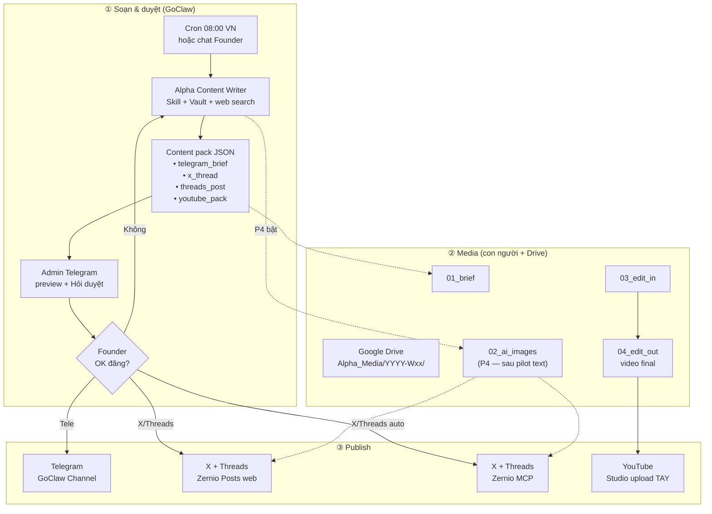
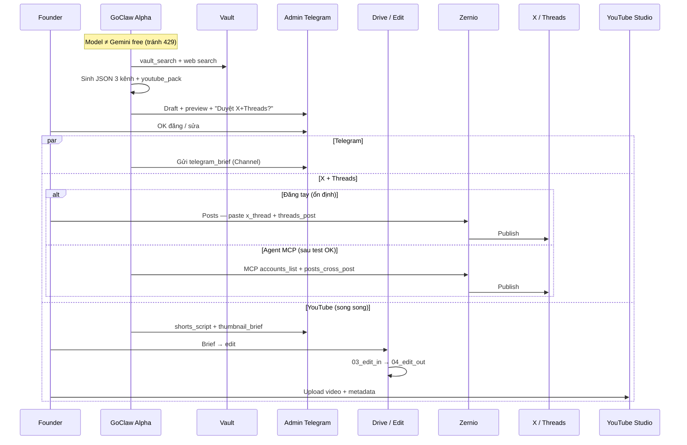
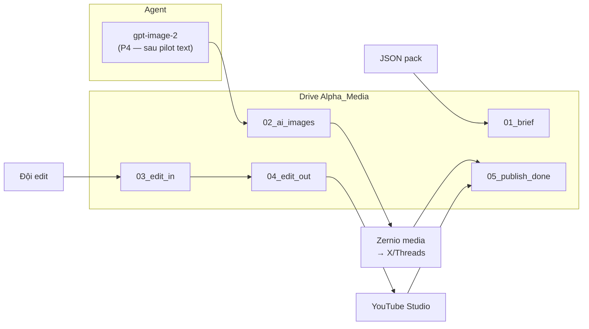
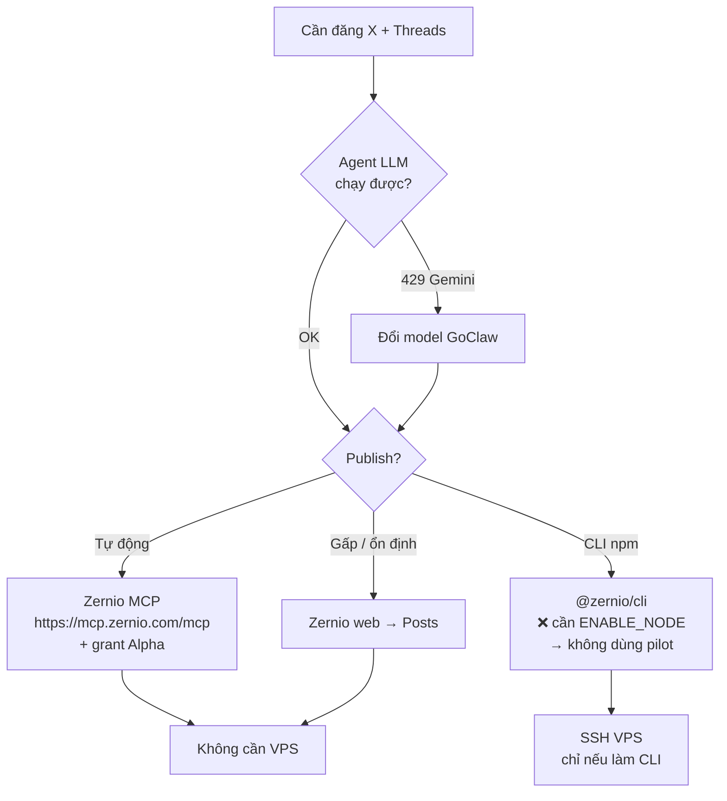

# Alpha Media — Luồng vận hành & phase (SSOT)

> **Scope:** Chỉ **Alpha Trading Lab** trước — Tele (admin) + X + Threads; YouTube script/video song song.  
> **Cập nhật:** 2026-05-20  
> **Tick trạng thái:** [`PILOT_ALPHA_AUDIT_STATUS.md`](./PILOT_ALPHA_AUDIT_STATUS.md) · **Tổng dự án:** [`PROJECT_STATUS.md`](../PROJECT_STATUS.md)  
> **Runbook UI:** [`GOCLAW_P4_P7_MEDIA_RUNBOOK.md`](./GOCLAW_P4_P7_MEDIA_RUNBOOK.md) · **Plan duyệt Telegram:** [`ALPHA_TELEGRAM_APPROVAL_PLAN.md`](./ALPHA_TELEGRAM_APPROVAL_PLAN.md) · **Skill:** [`goclaw-export/alpha-content-writer-skill.md`](./goclaw-export/alpha-content-writer-skill.md)

---

## 1. Luồng tổng thể (3 tầng)

Soạn & duyệt (GoClaw) → file media (Drive / edit) → đăng kênh.



**Lưu ý:** GoClaw **Vault** = kiến thức markdown — **không** là kho video/ảnh bulk.

---

## 2. Sequence — hàng ngày (pilot text)



---

## 3. Luồng file media (ảnh / video)



### Cấu trúc folder (khuyến nghị)

```text
Alpha_Media/
  2026-W21/
    01_brief/          ← JSON / brief từ agent
    02_ai_images/      ← ảnh AI (khi bật P4)
    03_edit_in/        ← đội edit gửi vào
    04_edit_out/       ← bản final duyệt
    05_publish_done/   ← link / screenshot đã đăng
```

---

## 4. Nhánh kỹ thuật Zernio (MCP vs CLI)



| Cách | Cần npm trên GoClaw? | Pilot Alpha |
|------|----------------------|-------------|
| **MCP hosted** | Không | **Khuyến nghị** |
| **Zernio Posts (web)** | Không | Baseline / gấp |
| **CLI** | Có | Bỏ qua (container thiếu npm) |

---

## 5. Phase dự án Alpha (A0–A6)

Map với P0–P7 cũ trong [`GOCLAW_ALPHA_PILOT_CHECKLIST.md`](./GOCLAW_ALPHA_PILOT_CHECKLIST.md).

| Phase | Mục tiêu | Map P# | Đóng khi |
|-------|----------|--------|----------|
| **A0** | Unblock runtime (model, MCP grant, accountId, skill ≠ CLI) | P0, P3 | Chat không 429; MCP test pass |
| **A1** | Content loop text 3 kênh + TG duyệt | P5 | 1 JSON pack + compliance PASS |
| **A2** | Publish E2E X + Threads (+ Tele brief) | P7 | URL post live (text OK) |
| **A3** | Cron 08:00 VN | P6 | Run now + 3 ngày draft ổn |
| **A4** | Vault 38/38 + smoke | P1 | 4 câu smoke pass |
| **A5** | Ảnh AI + Drive + YT edit | P4 + media | 1 post ảnh hoặc 1 Shorts (sau A2) |
| **A6** | Raymond / VIP / CSKH / SM | — | **Sau** đóng pilot Alpha |

### Lộ trình tuần (gợi ý)

```text
Tuần 1:  A0 → A1 → A2     (đóng pilot text)
         A4 song song (vault)

Tuần 2:  A3 (cron) + vận hành 3 ngày
         A5 bắt đầu (Drive + ảnh/Shorts)
```

### ASCII tóm tắt

```text
[Cron/Chat] → GoClaw Alpha → JSON pack
                    ↓
            Admin TG duyệt
                    ↓
         ┌──────────┼──────────┐
         ▼          ▼          ▼
    TG brief   Zernio X/TH   Drive→Edit→YT Studio
    (Channel)  (web/MCP)     (video)
```

---

## 6. Ma trận gap → phase (2026-05-20)

| Gap | Phase | Ưu tiên |
|-----|-------|---------|
| Gemini 429 | A0 | Ngay |
| CLI vs MCP lệch (skill ghi `zernio` exec) | A0 | Ngay |
| accountId trống | A0 | Ngay |
| Chưa JSON 3 kênh + TG duyệt | A1 | Ngay |
| Chưa post live X/Threads | A2 | Ngay |
| npm / Node Packages fail | — | Bỏ qua (dùng MCP) |
| P6 cron | A3 | Sau A2 |
| Vault 24/38 | A4 | Song song |
| Ảnh / video / Drive chưa quy ước | A5 | Sau A2 |
| Skill UI click trắng | A1 | Không block nếu agent chạy |

---

## 6b. Chuẩn upload skill GoClaw (ghi nhớ)

**Verified 2026-05-21:** `alpha-content-writer` v6 upload đúng khi GoClaw hiện modal skill với:

- Header: `alpha-content-writer` + badge `managed` + `internal` + version.
- Tab `Content` render được body `SKILL.md`.
- Frontmatter có `name` dùng **slug lowercase** (`alpha-content-writer`), không dùng tên hiển thị có khoảng trắng.
- ZIP phải có `SKILL.md` **ngay root**, không bị bọc thư mục.

Frontmatter chuẩn:

```yaml
---
name: alpha-content-writer
description: Use this skill whenever you need to generate Alpha Trading Lab XAUUSD/gold content for X/Twitter, Threads, Telegram admin review, or YouTube Shorts. Trigger contexts include daily market brief, cron 08:00 content pack, "viết bài", "tạo content", "draft XAUUSD", "sinh JSON content", "Alpha media", or publishing task.
version: 1.0.6
license: Proprietary
author: Alpha Trading Lab
tags: [alpha, xauusd, gold, content, twitter, threads, youtube]
dependencies:
  python: []
  node: []
---
```

Build/upload:

```powershell
$src = "g:\Other computers\My Computer\Project\GAI_AGENTS-lungmat_agent\docs\goclaw-export\skills\alpha-content-writer"
$zip = "g:\Other computers\My Computer\Project\GAI_AGENTS-lungmat_agent\docs\goclaw-export\skills\zips\alpha-content-writer.zip"
$desktop = "C:\Users\Admin\Desktop\goclaw-skills\alpha-content-writer.zip"
Remove-Item $zip -Force -ErrorAction SilentlyContinue
Compress-Archive -Path "$src\*" -DestinationPath $zip
Copy-Item $zip $desktop -Force
```

Sau upload: Skills → Custom → click tên skill. Pass khi modal hiện `Content` và render đúng markdown.

---

## 7. Tiêu chí đóng pilot Alpha (text v1)

- [ ] **A0** Done (model + MCP + accountId + skill hướng MCP)
- [ ] **A1** Done (JSON + TG + compliance)
- [ ] **A2** Done (X + Threads live)
- [ ] **A3** Done (cron 08:00 VN)
- [ ] **A4** Done (38/38 + smoke 4 câu)
- [x] **P4 / A5 ảnh** Skipped trong v1

**Không** bắt buộc A5 để đóng pilot text.

---

## 8. Link nhanh

| Tài liệu | URL / path |
|----------|------------|
| Zernio agents / MCP | https://zernio.com/agents · https://docs.zernio.com/resources/mcp |
| Zernio CLI (sau, cần npm) | https://docs.zernio.com/cli |
| GoClaw runtime | [`GOCLAW_RUNTIME_GUIDE.md`](./GOCLAW_RUNTIME_GUIDE.md) |
| Telegram-only scope | [`TELEGRAM_ONLY_GUIDE.md`](./TELEGRAM_ONLY_GUIDE.md) |
