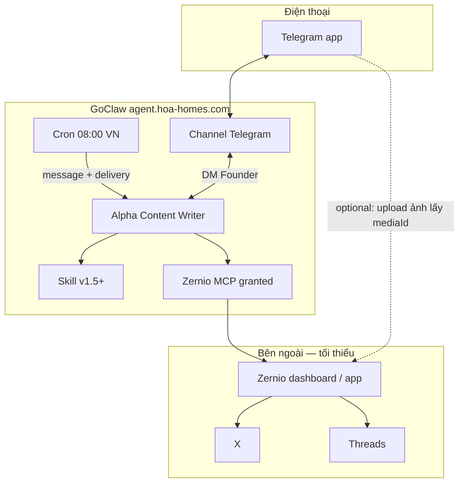
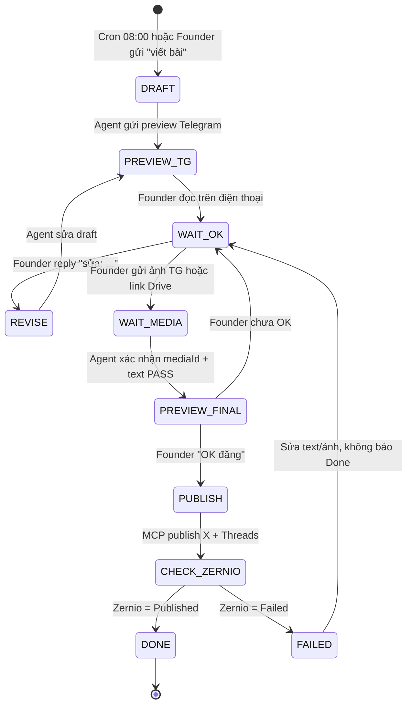
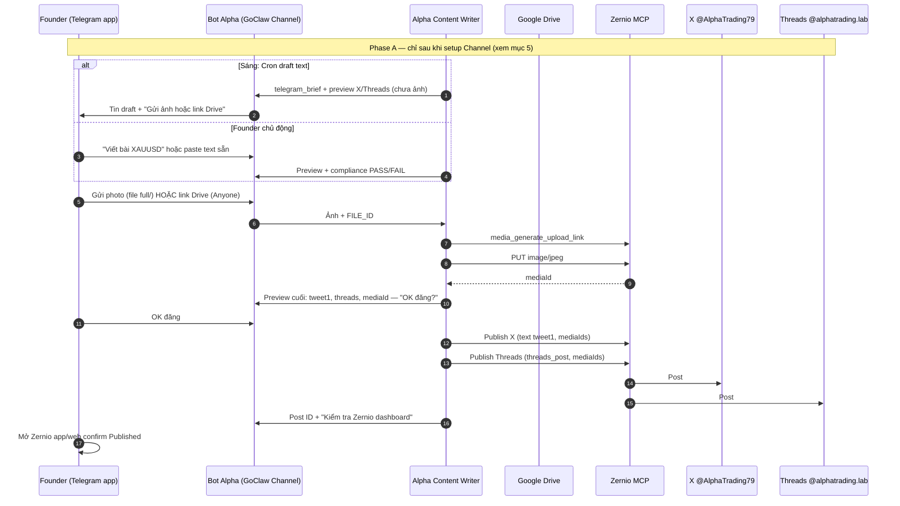
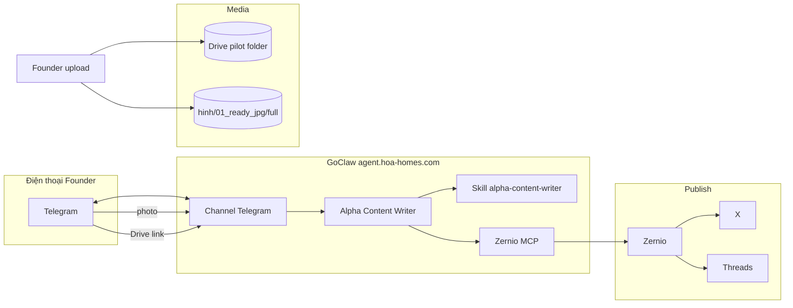

# Plan — Duyệt & đăng Alpha qua Telegram (text + ảnh Drive → Zernio)

> **Trạng thái:** **PLAN** — chưa triển khai skill/cron/channel mới.  
> **Mục tiêu duy nhất:** Founder **cầm điện thoại** — nhận draft → gửi ảnh + text → `OK đăng` → X + Threads qua Zernio. **Không** chat vòng vo trên GoClaw web.  
> **Cập nhật:** 2026-05-21

**Liên quan:** [`ALPHA_MEDIA_WORKFLOW.md`](./ALPHA_MEDIA_WORKFLOW.md) (tổng) · [`PILOT_ALPHA_AUDIT_STATUS.md`](./PILOT_ALPHA_AUDIT_STATUS.md) (tick)  
**Sau khi Founder duyệt plan:** mới làm [`ALPHA_TELEGRAM_PUBLISH.md`](./ALPHA_TELEGRAM_PUBLISH.md) (SOP vận hành) + cập nhật skill ZIP.

---

## 1. Vấn đề hiện tại

| Hiện trạng | Hệ quả |
|------------|--------|
| Duyệt trên **GoClaw web Chat** | Founder phải mở máy tính, agent hỏi nhiều vòng |
| `posts_cross_post` 1 field `text` | X >280, Threads fail |
| Ảnh crop 16:9 | Mất nội dung chart |
| Chưa có **Telegram Channel** gắn Alpha Writer | Không có “cửa” điện thoại thống nhất |

**Plan này chỉ thiết kế luồng duyệt + đăng** — không thêm tool/script mới cho đến khi sơ đồ được chốt.

---

## 1b. Review khả năng — chỉ dùng nguồn GoClaw sẵn có

> **Nguồn đối chiếu:** [`goclaw-export/handbook/`](./goclaw-export/handbook/) (04 Channel, 06 Built-in, 07 MCP, 08 Cron) · [`GOCLAW_RUNTIME_GUIDE.md`](./GOCLAW_RUNTIME_GUIDE.md) · [`PILOT_ALPHA_AUDIT_STATUS.md`](./PILOT_ALPHA_AUDIT_STATUS.md)

### Kết luận ngắn

| Câu hỏi | Trả lời |
|---------|---------|
| **Làm được trên GoClaw không?** | **Có — ~85%** luồng duyệt + đăng **không cần** lungmat VPS, script Windows, Zernio CLI, n8n |
| **Còn thiếu gì?** | Chủ yếu **cấu hình UI** (Telegram Channel + Cron delivery) + **Skill** (hành vi agent) — không thiếu platform |
| **Drive bắt buộc không?** | **Không** cho v1 — GoClaw Telegram nhận **photo** native; Drive = backup hoặc T5 (Google MCP) |

### Bảng tận dụng GoClaw (đã có trên nền)

| Nhu cầu plan | GoClaw có sẵn | Alpha live (audit) | Ghi chú |
|--------------|---------------|-------------------|---------|
| Nhận tin Founder **Telegram DM** | **Channel → Telegram** (webhook, photo, document) | ☐ chưa pair | Handbook §4.3 — **T1** |
| Agent trả lời / preview trên TG | **Messaging** `send_message`, `reply` | Có khi có Channel | Không cần web Chat |
| Session giữ context `OK đăng` | **Session** cùng channel + user | Mặc định Open agent | Cùng thread DM = cùng session |
| Draft sáng 08:00 VN | **Cron** + `timezone: Asia/Ho_Chi_Minh` + **Channel delivery** | P6 Not started | Handbook §8.3, §8.9 approval gate |
| Viết bài + compliance | **Skill** + **vault_search** + **web_search** | P5 Done | Đã có `alpha-content-writer` |
| Publish X + Threads | **MCP HTTP** Zernio (`mcp.zernio.com`) | P3 Partial, A2 Done (text) | **Không** dùng CLI/npm (fail trên container) |
| accountId X / Threads | Zernio MCP `accounts_list` | Done | Hardcode trong skill OK |
| Ảnh đính kèm từ TG | Channel media **photo** → agent (multimodal / `image_analyze`) | Chưa test | Ưu tiên **T0 = A** |
| Upload ảnh lên Zernio | MCP `media_generate_upload_link` | Partial | Cần PUT bytes — xem gap ảnh |
| Duyệt bằng text | Pattern **approval gate** Cron §8.9 + reply `OK đăng` | Done trên web | Chuyển sang TG — cùng cơ chế |
| Gen ảnh AI | `image_generate` (Media built-in) | P4 Skipped | Không cần pilot |
| Drive đọc file | **Không** built-in — cần **Google Drive MCP** | Chưa cài | **T5 optional** — tránh v1 |

### Gap analysis (plan vs GoClaw)

| # | Gap | Mức | Xử lý bằng GoClaw (không code repo) |
|---|-----|-----|--------------------------------------|
| G1 | **Telegram Channel** chưa gắn Alpha Writer | Blocker | UI: Channels → token BotFather → Pair agent → `dm_policy` allowlist Founder |
| G2 | Agent publish **sai** (`posts_cross_post` 1 text, >280) | Blocker | **Skill** (T2): 2 lần MCP hoặc tweet1 + `threads_post` tách; compliance trước publish |
| G3 | **Upload ảnh** TG → Zernio `uploadUrl` | Medium | **Ưu tiên 1:** Founder upload ảnh **Zernio app** → gửi bot `mediaId: xxx` (0 code). **Ưu tiên 2:** bật `exec`+`curl` hoặc `web_fetch` cho agent (rủi ro, handbook cảnh báo exec) |
| G4 | **Drive link** → bytes | Medium | Không có Drive MCP → dùng **photo TG** (G3a) hoặc T5 Google MCP |
| G5 | Cron chưa chạy | Low | UI Cron `0 8 * * *` + delivery Telegram `chat_id` admin |
| G6 | Duyệt trên **web Chat** thay TG | Process | Founder chuyển sang bot — không sửa GoClaw core |
| G7 | Gemini 429 | Done | Giữ **Claude Sonnet** trên agent (A0) |

**Không phải gap GoClaw:** crop script local, lungmat webhook, n8n — **bỏ** khỏi pilot TG.

### Sơ đồ triển khai tối thiểu (100% GoClaw UI)



### Đánh giá khả năng thực hiện (theo phase plan)

| Phase | Khả thi? | Dựa vào GoClaw |
|-------|----------|----------------|
| **T1** Channel TG | **Cao** | Native — 15–30 phút UI |
| **T2** Skill MCP + TG block | **Cao** | ZIP upload + Rescan (menu Skills) |
| **T3** E2E text + ảnh | **Trung bình–cao** | Text: đã Done A2. Ảnh: khuyến nghị **mediaId từ Zernio app** + TG (tránh G3) |
| **T4** Cron → TG draft | **Cao** | Cron + channel delivery (handbook §8.5) |
| **T5** Drive MCP | **Thấp / hoãn** | Cần thêm MCP server + OAuth — không cần nếu chọn **A** |

**Verdict:** Plan Telegram duyệt **khả thi**, nên **tận dụng tối đa** Channel + Cron + Skill + Zernio MCP; **không** xây thêm pipeline Drive/exec trước T3.

### Luồng vận hành đề xuất (sau T0 — chọn A)

| Bước | Ai | Kênh | GoClaw / tool |
|------|-----|------|----------------|
| 1 | Cron / Founder | TG bot | Agent sinh JSON + preview |
| 2 | Founder | TG bot | Gửi **photo** (hoặc `mediaId` đã upload Zernio tay) |
| 3 | Agent | TG bot | Compliance PASS + xác nhận mediaId |
| 4 | Founder | TG bot | `OK đăng` |
| 5 | Agent | Zernio MCP | Publish X rồi Threads (2 call) |
| 6 | Founder | Zernio app | Confirm **Published** |

Drive folder = lưu trữ team, **không** nằm trong critical path v1.

---

## 2. Sơ đồ — máy trạng thái duyệt



**Quy tắc cứng (không đàm phán trên TG):**

- Agent **không** gọi Zernio publish trước trạng thái `OK đăng`.
- Agent **không** báo “đã đăng” khi Zernio status = Failed.
- X: tweet 1 ≤280, **không URL**. Threads: ≤500, ảnh JPG/PNG (hoặc ảnh gửi từ TG / Drive public).

---

## 3. Sơ đồ — sequence (điện thoại)



---

## 4. Sơ đồ — khối hệ thống



**Drive** = kho/backup. **Đăng** = Zernio `mediaId` (ảnh từ TG photo hoặc tải từ Drive public link).

---

## 5. Plan triển khai (chỉ GoClaw UI + Skill)

| Phase | Việc | Menu GoClaw | Owner | Done khi |
|-------|------|-------------|-------|----------|
| **T0** | Chốt plan + **chọn A** (ảnh TG / mediaId) | — | Founder | Reply `OK plan A` |
| **T1** | Telegram Channel pair Alpha Writer | **Channels** §4 | Founder | DM `/start` → agent trả lời |
| **T1b** | Grant Zernio MCP + Built-in: vault, web, messaging; **tắt exec** (trừ khi test G3) | Agent → MCP / Built-in Tools | Founder | Test MCP OK |
| **T2** | Upload skill ZIP Telegram block + publish tách kênh | **Skills** | Cursor/Founder | Rescan Active |
| **T3** | E2E: draft TG → photo hoặc `mediaId` → `OK đăng` → Published | **Sessions** trace | Founder | Screenshot Zernio Published |
| **T4** | Cron `0 8 * * *` `Asia/Ho_Chi_Minh` → delivery admin `chat_id` | **Cron** §8 | Founder | Run now → draft TG |
| **T5** | Google Drive MCP | **MCP Servers** | — | **Skip** nếu T3 pass với A |

**Không làm (ngoài GoClaw):** `alpha-media-prep.ps1`, crop, lungmat bot, Zernio CLI, n8n.

---

## 6. Template tin nhắn Telegram (spec — sau T1)

**Founder → bot (một lần đăng):**

```text
[Ảnh đính kèm HOẶC dòng Drive: https://drive.google.com/file/d/FILE_ID/view]

X (<=280, không link):
...

Threads (<=500):
...

---
Chờ duyệt.
```

**Founder → bot (duyệt):**

```text
OK đăng
```

**Bot → Founder (bắt buộc):**

```text
Preview PASS
X: N ký tự | Threads: M ký tự
mediaId: xxx
Reply OK đăng để publish.
```

---

## 7. Gap so với hiện tại (tóm từ §1b)

| Hạng mục | GoClaw có? | Live Alpha? | Phase |
|----------|------------|-------------|-------|
| Zernio MCP text publish | Có | **Done** A2 | Giữ |
| Telegram Channel | Có | **Chưa** | T1 |
| Cron → TG | Có | **Chưa** | T4 |
| Skill TG + publish đúng | Có (upload) | **Partial** | T2 |
| Ảnh E2E qua TG | Có (photo + MCP) | **Chưa** | T3 |
| Drive auto | MCP riêng | **Không** | Skip T5 nếu A |

---

## 8. Quyết định Founder (T0)

- [x] **A — Đã chốt** 2026-05-21 (ảnh TG / `mediaId` Zernio · không Drive MCP · không `exec`)

**Agent GoClaw:** **Alpha Content Writer đã có** — T1b chỉ **Edit**, không **+ Tạo agent**. T1 chỉ **+ Channel** Telegram rồi **Pair** agent đó.

---

## 9. Sau khi chốt plan

1. Tick T0 trong [`PILOT_ALPHA_AUDIT_STATUS.md`](./PILOT_ALPHA_AUDIT_STATUS.md).
2. **Giao Claude Cowork:** [`briefs/alpha-telegram-approval-cowork-brief.md`](./briefs/alpha-telegram-approval-cowork-brief.md) — checklist T1–T4 trên GoClaw UI.
3. Bật SOP [`ALPHA_TELEGRAM_PUBLISH.md`](./ALPHA_TELEGRAM_PUBLISH.md) sau T3 pass.

**Không** chỉnh thêm `alpha-media-prep.ps1` / folder `hinh` cho đến khi T3 pass.
