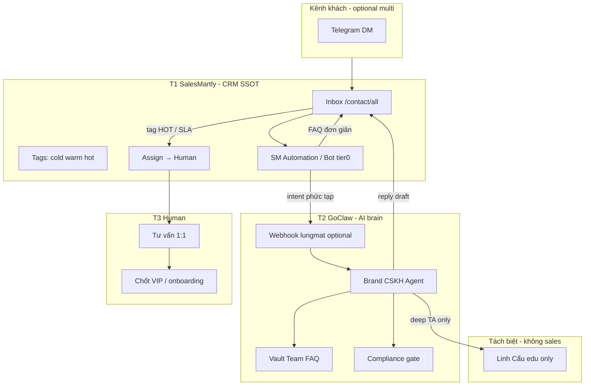

# SWOT — Phương án kết hợp 1:1: Digitop BĐS + SalesMartly + Human

> ⚠️ **Scope dự án chốt: chỉ Telegram.** Đọc trước: **[`TELEGRAM_ONLY_GUIDE.md`](./TELEGRAM_ONLY_GUIDE.md)** — SSOT vận hành.  
> File này = nghiên cứu **optional** (SalesMartly CRM + đa kênh). **Mặc định không triển khai** Zalo/FB/SM trừ khi Founder đổi scope.

> **Mục đích:** Nghiên cứu & plan cho **tư vấn khách 1:1** — không trộn với Linh Cẩu (edu) hay Content Writer (media).  
> **Audit code:** [`CODEBASE_AUDIT_DIGITOP_TELEGRAM.md`](./CODEBASE_AUDIT_DIGITOP_TELEGRAM.md)

**Cập nhật:** 2026-05-19

---

## 0. Phương án mặc định (Telegram-only) — không cần SalesMartly

| Tầng | Công cụ | Việc |
|------|---------|------|
| AI CSKH 1:1 | GoClaw + bot TG brand | `alpha-cskh-1to1-skill.md` |
| Human chốt | Founder trả **trong TG DM** | Ping `ADMIN_TELEGRAM_CHAT_ID` khi HOT |
| Edu | Linh Cẩu `@linhcau79_bot` | Redirect sales sang bot brand |
| Media duyệt | Admin TG → Zernio | `GOCLAW_ALPHA_PILOT_CHECKLIST.md` |

Chi tiết: [`TELEGRAM_ONLY_GUIDE.md`](./TELEGRAM_ONLY_GUIDE.md).

---

## 1. Executive summary (Hybrid — optional SM)

| Tầng | Vai trò | Công cụ |
|------|---------|---------|
| **T1 — Inbox & CRM** | Một nơi xem mọi khách (optional) | **SalesMartly** — chỉ nếu connect TG vào SM |
| **T2 — AI 24/7** | Qualify, FAQ, compliance | **GoClaw** Brand CSKH |
| **T3 — Human** | Tư vấn, chốt VIP | Founder (TG hoặc SM UI) |

**Chỉ dùng phần dưới nếu Founder muốn CRM SalesMartly.** Mặc định dự án: **§0 Telegram-only.**

---

## 2. Phương án H — Hybrid Hub (đề xuất chính)

### 2.1 Sơ đồ



### 2.2 Nguyên tắc vận hành (5 quy tắc)

1. **Một thread — một người/agent đang trả lời** (tránh SM bot + GoClaw cùng ping).
2. **SalesMartly = sổ địa chỉ khách** — mọi tag, assign, note nằm ở `/contact/all`.
3. **GoClaw = não** — qualify script, FAQ vault brand, không signal trading.
4. **Human = chốt & tư vấn** — khi `HOT`, phàn nàn, giá đặc biệt, hoặc khách yêu cầu “gặp người”.
5. **Linh Cẩu không sales** — chỉ nhận redirect từ CSKH khi hỏi kiến thức TA.

### 2.3 Phân công 3 tầng (RACI đơn giản)

| Việc | SalesMartly | GoClaw AI | Human |
|------|:-----------:|:---------:|:-----:|
| Gom tin nhắn đa kênh | **R** | I | I |
| Trả lời FAQ giá/onboarding 24/7 | A | **R** | C |
| Qualify (tên, KN, mục tiêu) | A | **R** | I |
| Tag cold/warm/hot | **R** | C | A |
| Tư vấn VIP / negotiation | I | I | **R** |
| Trading insight sâu | I | C → Linh Cẩu | **A** |
| Lưu lịch sử contact | **R** | C (memory) | A |
| Compliance review edge case | I | C | **R** |

*R = Responsible, A = Accountable, C = Consulted, I = Informed*

### 2.4 Luồng tin nhắn (từng bước)

```text
1. Khách nhắn (TG/Zalo/FB…) → SalesMartly inbox (contact/all)
2. Tier-0 (optional): SM automation — chào, thu tên/SĐT nếu thiếu
3. Tier-1: GoClaw CSKH (qua kênh SM connect HOẶC webhook):
   - FAQ Team Vault · qualify · compliance PASS
   - Ghi tag warm/cold trong SM (manual hoặc automation rule)
4. Nếu intent = TRADE_INSIGHT / CONTENT_REQUEST:
   - Webhook → lungmat/GoClaw (draft insight, KHÔNG auto gửi signal)
   - Trả lời khách: giáo dục ngắn + link kênh / Linh Cẩu
5. Nếu HOT_LEAD (mua VIP, giận, sẵn sàng chuyển khoản):
   - SM: tag HOT + assign Human
   - Notify ADMIN_TELEGRAM_CHAT_ID (song song)
   - Human trả lời TRONG SalesMartly (không Zalo cá nhân rời CRM)
6. Human chốt → SM note + tag Won/Lost
```

### 2.5 So với 3 phương án cũ (cập nhật)

| Phương án | Mô tả | Khi dùng |
|-----------|--------|----------|
| B — GoClaw TG only | Bot brand, không SM | Chỉ TG, volume thấp, chưa dùng SM |
| C — SM only | SM AI + human, không GoClaw | Thiếu vault trading chuẩn |
| **H — Hybrid Hub** | **SM CRM + GoClaw AI + Human** | **Founder đã có SM contact/all** ✅ |

---

## 3. SWOT Analysis

### 3.1 Strengths (Điểm mạnh)

| # | Điểm mạnh | Giải thích |
|---|-----------|------------|
| S1 | **Digitop UC-01 đã chứng minh mô hình** | CSKH 24/7 + qualify + handoff human — map trực tiếp trading community |
| S2 | **SalesMartly = inbox thống nhất** | [`contact/all`](https://app.salesmartly.com/next/contact/all) — hết data rải Zalo/TG/Excel (pain #2 BĐS) |
| S3 | **GoClaw tách não theo brand** | Alpha/Raymond/VIP10X isolation — tránh lẫn giọng VIP10X trên Alpha |
| S4 | **Human giữ trust chốt deal** | BĐS/trading đều cần người khi tiền thật — AI không thay hoàn toàn |
| S5 | **Repo đã có SOP + skeleton** | `SalesMartlyClient`, `SOP_SalesMartly_Hybrid.md`, `alpha-cskh-1to1-skill.md` |
| S6 | **Compliance có thể gate 2 lớp** | GoClaw Skill + Human review trước khi hứa giá/gói |
| S7 | **SM chứng chỉ ISO 27001/27701** | Giảm rủi ro Shadow AI so với paste ChatGPT (UC-03 Digitop) |
| S8 | **Tách Linh Cẩu** | Edu không lẫn sales — giảm rủi ro reputation |

### 3.2 Weaknesses (Điểm yếu)

| # | Điểm yếu | Mức độ | Giảm thiểu |
|---|----------|--------|------------|
| W1 | **Webhook lungmat chưa wire** (`dispatchToAgent` TODO) | 🔴 Cao | Phase 1 mount route + notify TG |
| W2 | **Hai AI có thể double-reply** (SM bot + GoClaw) | 🔴 Cao | Rule: tắt SM bot khi bật GoClaw tier-1 |
| W3 | **Founder = bottleneck Human** | 🟠 TB | Chỉ HOT lên người; warm = nurture AI |
| W4 | **Đồng bộ memory SM ↔ GoClaw** | 🟠 TB | `conversation_id` làm key; log vào SM note |
| W5 | **Chưa verify API 2 chiều SM↔GoClaw** | 🟠 TB | Spike 1 ngày: SM webhook + reply API |
| W6 | **3 brand × nhiều kênh = setup nặng** | 🟡 | Pilot Alpha 1 kênh TG qua SM trước |
| W7 | **Chi phí 2 nền tảng** | 🟡 | SM subscription + GoClaw host |
| W8 | **SOP cũ gọi Linh Cẩu dispatch** | 🟡 | Sửa: TRADE_INSIGHT → edu snippet, không `/content` auto |

### 3.3 Opportunities (Cơ hội)

| # | Cơ hội | Hành động |
|---|--------|-----------|
| O1 | **Giảm 30% mất lead do trễ** (Digitop cite) | SLA AI <30s trên SM inbox |
| O2 | **Zalo/FB ads → SM** mà không thêm bot mới | Connect kênh vào SM |
| O3 | **Pipeline nhìn một màn** | Tag + filter hot/warm trên contact/all |
| O4 | **Báo cáo tuần tự động** | Cron GoClaw đọc SM export / webhook aggregate |
| O5 | **Nhân viên sales sau này** | Assign trong SM — Founder không ôm hết |
| O6 | **Cross-sell 3 brand** | SM custom field `brand_interest` |
| O7 | **Chống Shadow AI** | Bắt buộc trả lời trong SM/GoClaw nội bộ |

### 3.4 Threats (Rủi ro / Mối đe dọa)

| # | Rủi ro | Mức | Ứng phó |
|---|--------|-----|---------|
| T1 | AI hứa lợi nhuận / signal | 🔴 | Compliance gate + Human review HOT |
| T2 | Data khách lộ (Agents of Chaos) | 🔴 | SM permission + Vault brand scope |
| T3 | Khách nhận 2 câu trả lời khác nhau | 🟠 | Một actor/thread; tắt tier trùng |
| T4 | Founder quên takeover SM | 🟠 | Notify TG + SM SLA alert |
| T5 | Phụ thuộc vendor SM hoặc GoClaw down | 🟠 | Human fallback manual; export contact |
| T6 | Luật DN Việt Nam (NĐ 13) | 🟡 | SM ISO + không đưa PII lên ChatGPT công |
| T7 | Nhầm VIP10X tone trên Alpha | 🟡 | Agent + tag brand cứng trong SM |

---

## 4. Ma trận SWOT — Chiến lược (TOWS)

| | **Opportunities** | **Threats** |
|---|-------------------|-------------|
| **Strengths** | **SO:** Dùng SM inbox + GoClaw CSKH để SLA <30s; mở Zalo ads vào SM (O1,O2) | **ST:** Compliance 2 lớp; brand isolation (T1,T7) |
| **Weaknesses** | **WO:** Wire webhook trước khi scale ads (W1); pilot Alpha 1 kênh (W6) | **WT:** Tắt double AI; Founder chỉ HOT (W2,W3,T3) |

**Chiến lược ưu tiên:**

1. **SO-1:** SalesMartly làm hub → GoClaw CSKH trả FAQ 24/7 → Human chỉ HOT.  
2. **WT-1:** Một thread một responder — cấu hình SM automation trước khi bật GoClaw.  
3. **ST-1:** Compliance checklist trong Skill + không auto-publish content từ sales chat.

---

## 5. Plan triển khai (4 phase)

### Phase 0 — CRM thuần (1 tuần, không code)

| Việc | Owner |
|------|-------|
| Connect Telegram Alpha vào SalesMartly | Founder |
| Dùng `/contact/all` làm nơi duy nhất trả lời | Founder |
| Tag: `cold` `warm` `hot` + `brand:alpha` | Founder |
| Tắt SM AI auto nếu sẽ bật GoClaw sau | Founder |
| Template trả lời FAQ (copy tạm) | Founder |

**Exit:** 10 hội thoại thật được tag đủ trong SM.

### Phase 1 — AI + Human handoff (2 tuần)

| Việc | Owner |
|------|-------|
| Paste GoClaw **Alpha CSKH** skill | Cowork |
| Vault Team Alpha FAQ (3 file) | Founder |
| SM rule: hot → assign Founder + notify TG | Founder |
| Mount `POST /salesmartly/webhook` + `notifyHumanHandler` | Cursor |
| Test HOT_LEAD → TG trong 60s | Founder |

**Exit:** 1 lead HOT được human chốt trong SM, có log TG.

### Phase 2 — Webhook expert (2–3 tuần)

| Việc | Owner |
|------|-------|
| `dispatchToAgent` → draft (không signal) cho TRADE_INSIGHT | Cursor |
| Reply draft vào SM (API hoặc copy workflow) | Founder verify API |
| Raymond/VIP10X CSKH clone | Cowork |
| Zalo connect SM (nếu có ads) | Founder |

**Exit:** Khách hỏi outlook vàng → AI draft edu + human không cần gõ lại FAQ.

### Phase 3 — Scale & báo cáo (ongoing)

| Việc | Owner |
|------|-------|
| Cron pipeline báo cáo T2 (Digitop UC-04) | GoClaw |
| Hire sales → SM assign rules | Founder |
| Supabase sync `conversation_id` (optional) | Cursor |

---

## 6. Cấu hình SalesMartly đề xuất (contact/all)

| Field / Tag | Giá trị | Ai set |
|-------------|---------|--------|
| `brand` | alpha \| raymond \| vip10x | AI hoặc rule kênh |
| `stage` | cold \| warm \| hot | AI qualify |
| `intent` | pricing \| onboarding \| ta_edu \| complaint | AI |
| `handoff` | none \| ai \| human | System |
| `source` | tg \| zalo \| fb \| ads | SM auto |

**Automation gợi ý (trong SM UI):**

- Tin chứa “giá”, “VIP”, “mua”, “chuyển khoản” → tag `hot` + notify assign.  
- Tin chờ >5 phút khi `hot` → alert Founder TG.  
- Sau chốt → tag `won` / `lost`.

*(Chi tiết menu SM phụ thuộc phiên bản tài khoản — Founder chỉnh trong UI.)*

---

## 7. Tích hợp kỹ thuật repo (delta)

| Hạng mục | Hiện tại | Cần |
|----------|----------|-----|
| `src/routes/salesmartly.ts` | Có, chưa mount | Mount trong `index.ts` |
| `SalesMartlyClient.dispatchToAgent` | TODO | Gọi draft text → trả SM (hoặc log cho human paste) |
| `notifyHumanHandler` | TODO | `TelegramClient.sendMessage(ADMIN_*)` |
| GoClaw Alpha CSKH | Skill file | Paste + connect cùng TG account SM |
| Linh Cẩu | Live | Thêm redirect sales → SM inbox / bot Alpha |

**Webhook payload** — giữ schema [`SOP_SalesMartly_Hybrid.md`](./SOP_SalesMartly_Hybrid.md) §B; thêm field `channel`, `brand_id` nếu SM gửi được.

---

## 8. KPI đề xuất

| KPI | Mục tiêu 90 ngày |
|-----|------------------|
| Thời gian phản hồi đầu (AI) | < 30 giây |
| % HOT có human reply | < 2 giờ (giờ làm việc) |
| % hội thoại có tag stage | > 90% |
| Lead mất do trễ (ước) | Giảm (baseline Founder đo) |
| Incident compliance | 0 signal / 0 hứa lợi nhuận |

---

## 9. Quyết định Founder (checklist)

```text
☐ Chốt Phương án H: SalesMartly = CRM SSOT + GoClaw AI + Human HOT
☐ Phase 0: chỉ SM + human — 1 tuần
☐ Tắt SM bot trùng trước khi bật GoClaw CSKH
☐ Alpha pilot 1 brand / 1 kênh TG qua SM
☐ Wire webhook Phase 1 (Cursor task)
☐ Không dispatch sales chat → /content auto publish
☐ Linh Cẩu giữ edu-only
```

---

## 10. Kết luận SWOT (1 đoạn)

Phương án **SalesMartly (inbox/CRM) + GoClaw (AI CSKH theo Digitop BĐS) + Human (tư vấn chốt)** là **phù hợp và nên làm** vì Founder đã có `contact/all` và pain “data rải + trễ reply” khớp case BĐS. **Điểm yếu lớn nhất** là tích hợp kỹ thuật chưa xong và rủi ro **hai AI cùng trả lời** — giải bằng Phase 0–1 kỷ luật một thread một responder. **Không nên** gộp sales vào Linh Cẩu hoặc bỏ SM để chỉ GoClaw khi đã đầu tư SM làm trung tâm contact.

---

## 11. Tài liệu liên quan

| File | Nội dung |
|------|----------|
| [`DIGITOP_REALESTATE_1TO1_APPLICATION.md`](./DIGITOP_REALESTATE_1TO1_APPLICATION.md) | 4 lane, GoClaw CSKH |
| [`SOP_SalesMartly_Hybrid.md`](./SOP_SalesMartly_Hybrid.md) | Webhook schema (cần cập nhật theo Phương án H) |
| [`goclaw-export/alpha-cskh-1to1-skill.md`](./goclaw-export/alpha-cskh-1to1-skill.md) | Skill AI |
| [`AGENT_ROSTER_AUDIT.md`](./AGENT_ROSTER_AUDIT.md) | Agent gap |

*Tham chiếu: [digitop.ai/use-cases/real-estate](https://digitop.ai/use-cases/real-estate/) · [salesmartly.com](https://www.salesmartly.com/) · [app.salesmartly.com/next/contact/all](https://app.salesmartly.com/next/contact/all)*
