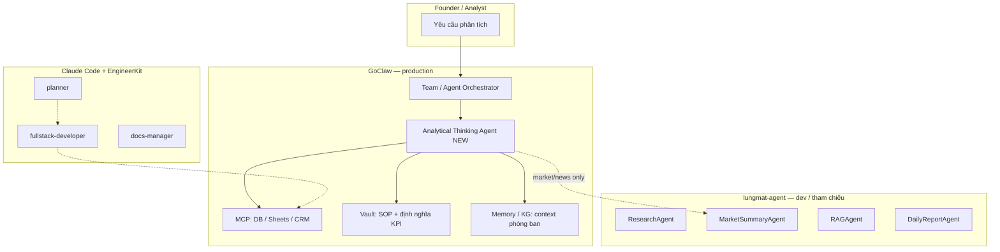

# Brief — Triệu hồi agent: Analytical Thinking + data công ty

> **Lưu ý:** Nếu mục tiêu là **điều phối agent GoClaw đã có** (không làm thủ công từng agent) → dùng **[`goclaw-media-os-orchestrator-team-brief.md`](./goclaw-media-os-orchestrator-team-brief.md)** (Team Router + Orchestrator).

> **Nội dung gốc:** Founder · contact `miyeonsavage347089@gmail.com`  
> **Áp dụng vào:** lane **Analytics / BI** (tùy chọn, sau Media OS Team)  
> **Không trộn** với pilot Alpha Telegram T1–T4

**Cập nhật:** 2026-05-21

---

## 1. Nội dung cần “ứng dụng” (copy SSOT)

**Tiêu đề / hook:** Điều khiển AI Agent làm tư duy phân tích dữ liệu

**Thân bài (rút gọn):**

> Những ai từng làm phân tích dữ liệu bài bản mới hiểu tốn công sức, tốn thời gian thế nào. Giờ điều khiển AI Agents — WOA! — tốc độ và độ chính xác khiến mình vẫn chưa quen. Ngày xưa cầm dataset loay hoay mới “comprehensive”; giờ làm Agent **Analytical Thinking** + **connect data thật công ty** + **business context** (ngành, phòng ban) → bùm, xong.

**3 capability cần agent cover:**

| # | Capability | Đầu ra mong muốn |
|---|------------|-------------------|
| C1 | **Analytical Thinking** | Khung phân tích (giả thuyết, so sánh, insight, không bịa số) |
| C2 | **Connect data thật** | Query/đọc bảng số từ nguồn công ty (DB, Sheet, CRM, warehouse) |
| C3 | **Business context** | Lọc theo ngành hàng, phòng ban, KPI nội bộ — không phân tích “trôi nổi” |

**Metadata nội bộ (không đăng public):** `miyeonsavage347089@gmail.com`

---

## 2. Triệu hồi agent — ai làm việc gì



### Bảng roster (triệu hồi)

| Vai trò | Agent / layer | Nền tảng | Trạng thái | Ghi chú |
|---------|---------------|----------|------------|---------|
| **Orchestrator** | GoClaw **Team Link** “Analytics Team” (Data Lead) | GoClaw | Chưa tạo | Handbook `02-team-link.md` § Analytics Team |
| **Analytical Thinking** | **`analytical-thinking-agent`** (Skill mới) | GoClaw | **Repo skill** → chưa live | [`analytical-thinking-agent-skill.md`](../goclaw-export/analytical-thinking-agent-skill.md) |
| **Data connector** | MCP (PostgreSQL, Google Sheets, Notion, n8n webhook…) | GoClaw MCP | Cấu hình theo stack công ty | Không dùng `exec` trừ admin |
| **Business context** | Vault **Team** scope + Memory scope `team` | GoClaw | Cần upload SOP/KPI | Tách brand Alpha/XAUUSD |
| **Entity / quan hệ** | Knowledge Graph (optional) | GoClaw | P2 | Phòng ban ↔ KPI ↔ dataset |
| **Market / news** (không thay BI) | `MarketSummaryAgent`, `ResearchAgent` | lungmat dev | Code có | Chỉ XAUUSD/news — không gộp sales data |
| **Báo cáo định kỳ** | `DailyReportAgent` + Cron | lungmat / GoClaw Cron | Code có | Clone pattern sang analytics cron |
| **Compliance số liệu** | Layer trong Skill AT | GoClaw | Trong skill | Mọi số phải `source + timestamp` |
| **Đăng story (marketing)** | Alpha Content Writer | GoClaw | Live | Post **riêng** — không nhầm với XAUUSD brief |
| **Build connector / ETL** | EngineerKit `planner` + `fullstack-developer` | Claude Code | Kit | Không thêm `src/agents/` trừ webhook |

### Không triệu hồi cho task này

| Agent | Lý do |
|-------|--------|
| Linh Cẩu | Edu trading — không BI nội bộ |
| Alpha CSKH | Sales 1:1 |
| `ContentAgent` / Zernio path | Media X/Threads — khác domain |
| Gemini free trên agent analytics | 429 — dùng Claude Sonnet |

---

## 3. Khác với pilot Alpha (Telegram + Zernio)

| | **Alpha media pilot** | **Analytics lane (brief này)** |
|--|----------------------|--------------------------------|
| Mục tiêu | Đăng X/Threads gold | Phân tích data công ty |
| Kênh | Telegram admin + Zernio | GoClaw chat / Team / DM nội bộ |
| Skill | `alpha-content-writer` | `analytical-thinking-agent` |
| Data | Vault TA + web | **MCP DB/Sheet + business context** |
| Founder | `OK đăng` publish | Review insight / export báo cáo |

**Có thể dùng chung GoClaw tenant** — **không** gộp chung một agent.

---

## 4. Triển khai GoClaw (thứ tự đề xuất)

| Phase | Việc | Owner |
|-------|------|-------|
| **AT0** | Upload Vault: SOP phân tích, data dictionary, KPI theo phòng ban | Founder |
| **AT1** | Tạo MCP server(s) đọc data thật (read-only trước) | Founder + dev |
| **AT2** | GoClaw Agent **Analytical Thinking** + paste Skill ZIP | Founder |
| **AT3** | Test 1 câu: “Phân tích [metric] Q1 theo phòng [X] — nguồn [MCP]” | Founder |
| **AT4** | (Optional) Team Link Analytics — pipeline nhiều bước | Sau AT3 |
| **AT5** | (Optional) Alpha Writer đăng story marketing từ §1 | Sau AT3 |

**Skill file:** [`docs/goclaw-export/analytical-thinking-agent-skill.md`](../goclaw-export/analytical-thinking-agent-skill.md)

---

## 5. Variant nội dung đăng (Alpha / LinkedIn / Threads — tùy chọn)

Dùng **Alpha Content Writer** hoặc copy tay — **không** gắn email public:

```text
Từng làm analytics bài bản mới hiểu mất bao nhiêu giờ cho một báo cáo "comprehensive".

Giờ stack mình chạy: Agent Analytical Thinking + data thật công ty + context ngành/phòng ban → draft insight trong phút, human duyệt số liệu rồi chốt.

Không phải ChatGPT một cửa — có Vault SOP, MCP read data, compliance từng con số.

#AIAgents #Analytics #DataDriven
```

---

## 6. Claude Cowork / Cursor — ai làm gì

| Tool | Nhiệm vụ |
|------|----------|
| **Cowork** | AT0–AT3 trên GoClaw UI; thu screenshot test |
| **Cursor** | Sửa skill, MCP doc, connector stub |
| **EngineerKit** | Plan schema MCP + migration read-only |

---

## 7. Báo cáo tick (template)

```markdown
## Analytical Thinking Agents — YYYY-MM-DD

| Phase | Status | Evidence |
|-------|--------|----------|
| AT0 Vault context | | |
| AT1 MCP data | | |
| AT2 Skill live | | |
| AT3 Test query | | |
| Marketing post (optional) | | |
```

Cập nhật: [`AGENT_ROSTER_AUDIT.md`](../AGENT_ROSTER_AUDIT.md) § Analytics lane.

---

*Contact nội bộ: miyeonsavage347089@gmail.com — không đưa vào post public.*
