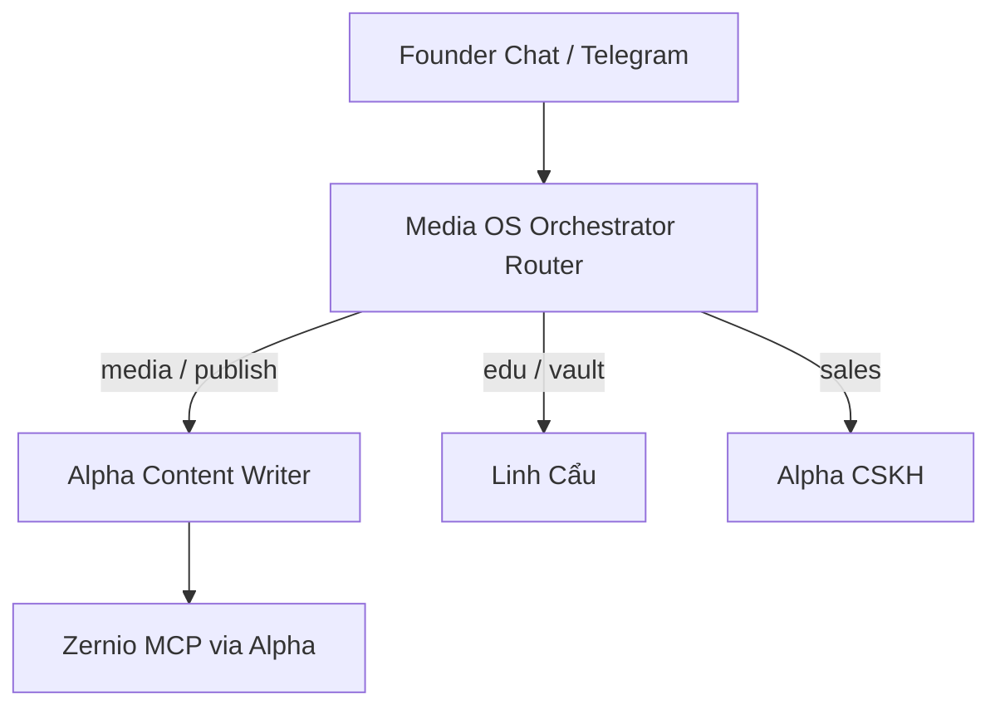

# Brief — GoClaw Team điều phối agent (Media OS)

> **Mục tiêu:** Founder nhắn **một cửa** (Chat / Telegram) → **Orchestrator** phân task → agent chuyên môn xử lý — **không** mở từng agent thủ công.  
> **UI:** GoClaw → **Agent Link & Team** → tab **Teams** → **+ Create Team** (ảnh Founder đã mở đúng menu).  
> **Handbook:** [`handbook/02-team-link.md`](../goclaw-export/handbook/02-team-link.md)

**Cập nhật:** 2026-05-21  
**Không thay:** pilot Alpha T1–T4 (có thể gắn Telegram vào Orchestrator **sau** khi team ổn).

---

## 1. Trước vs sau

| Trước (thủ công) | Sau (Team) |
|------------------|------------|
| Mở **Alpha Content Writer** → viết bài | Nhắn **Media OS Orchestrator** → route sang Alpha Writer |
| Mở **Linh Cẩu** → hỏi vault | Cùng cửa → route sang Linh Cẩu |
| Tự nhớ agent nào làm gì | Orchestrator + routing rules trong Skill |
| Không audit pipeline | Kanban Board: Pending → Running → Done |

---

## 2. Agent đã có trên GoClaw (member — không tạo trùng)

| Agent (đã có / sẽ có) | Vai trò trong Team | Role member |
|------------------------|-------------------|-------------|
| **Media OS Orchestrator** | **Điều phối** — agent **mới**, Predefined | *(Orchestrator — không phải member)* |
| **Alpha Content Writer** | JSON brief, duyệt, Zernio publish | Worker |
| **Linh Cẩu** 🐆 | Edu, vault Q&A — không sales | Worker |
| **Alpha CSKH** _(sau pilot)_ | Giá VIP, qualify 1:1 | Worker |
| **Raymond / VIP Writer** _(A6)_ | Brand #2 #3 | Worker |
| **Lửng Mật Coach** _(optional)_ | Admin ops | Specialist |

**Chỉ tạo mới:** 1 agent **Orchestrator** + 1 **Team** — **không** clone Alpha/Linh Cẩu.

---

## 3. Loại Team chọn cho dự án này

| Type | Dùng khi | Media OS |
|------|----------|----------|
| **Router** | Nhiều loại yêu cầu — orchestrator chọn agent | **Khuyến nghị cửa vào chính** |
| **Sequential** | Pipeline cố định A→B→C | Sub-team “Alpha Publish” (sau) |
| **Parallel** | Nhiều góc nhìn cùng lúc | Hiếm — không cần v1 |

**Cửa Founder:** Team **Router** tên ví dụ `Media OS`.

---

## 4. Các bước trên GoClaw UI

### Bước 1 — Tạo agent Orchestrator (Predefined)

**Agents** → **+ Tạo agent** (agent mới, khác Alpha):

| Field | Giá trị |
|-------|---------|
| Name | `Media OS Orchestrator` |
| Type | **Predefined** (bắt buộc để làm orchestrator / member team) |
| Model | Claude Sonnet 4.5 |
| Skill | Paste [`media-os-orchestrator-skill.md`](../goclaw-export/media-os-orchestrator-skill.md) |

**Không** gắn Zernio MCP trực tiếp — orchestrator **delegate**, không đăng bài.

### Bước 2 — Create Team

**Agent Link & Team** → tab **Teams** → **+ Create Team**:

| Field | Giá trị |
|-------|---------|
| Name | `Media OS` |
| Description | Điều phối media + edu + CSKH cho XAUUSD stack |
| Team type | **Router** |
| Orchestrator | `Media OS Orchestrator` |

### Bước 3 — Thêm Members

Team → **Members** → **+ Thêm Member** (từng agent **Predefined** đã có):

1. **Alpha Content Writer** — Role: **Worker**  
2. **Linh Cẩu** — Role: **Worker**  
3. _(Sau)_ Alpha CSKH, Raymond, VIP — Worker  

Nếu báo lỗi “Open agent không vào team” → đổi agent đó sang **Predefined** trong Agents → Settings.

### Bước 4 — Routing rules (tab Cài đặt / trong Skill)

Orchestrator đọc Skill — quy tắc intent (xem file skill). Ví dụ:

| Intent / từ khóa | Chuyển cho |
|------------------|------------|
| viết bài, XAUUSD, draft, Zernio, đăng X | Alpha Content Writer |
| FVG, học, vault, không giá VIP | Linh Cẩu |
| giá, mua, VIP, chốt, 1:1 | Alpha CSKH |
| coach, vận hành, debug | Lửng Mật Coach |

Fallback: Alpha Content Writer hoặc hỏi Founder 1 câu làm rõ.

### Bước 5 — Workspace Team (optional)

Team → **Workspace** → Shared Vault / Memory scope **Team** — SOP chung, accountId Zernio, link pilot.

### Bước 6 — Cửa vào (Chat / Telegram)

| Kênh | Gắn vào |
|------|---------|
| **GoClaw Chat** (test) | Pair Channel hoặc chat trực tiếp với **Orchestrator** |
| **Telegram admin** (sau T1) | Có thể pair bot → **Orchestrator** thay vì chỉ Alpha — **một bot, nhiều việc** |

Pilot hiện tại: Telegram vẫn có thể pair **Alpha** trước; khi Team ổn → đổi pair sang Orchestrator.

---

## 5. Agent Link (tab thứ 2) — khi nào dùng

**Agent Links** = 2 agent nối thẳng **không** qua team — dùng cho rule đơn giản:

| Link | Trigger | Target |
|------|---------|--------|
| Linh Cẩu → Alpha CSKH | “giá”, “mua VIP”, “tư vấn” | Alpha CSKH |
| Linh Cẩu → Orchestrator | “viết bài”, “content” | _(hoặc để Router team xử lý)_ |

**Ưu tiên Team Router** làm cửa chính; Link chỉ bổ sung redirect (handbook §2.9).

---

## 6. Pipeline đăng bài (Sequential — tùy chọn sau)

Khi Alpha ổn, có thể thêm **sub-team** `Alpha Publish Pipeline`:

```text
Sequential: Research context → Alpha Writer (JSON) → [Founder OK trên TG] → publish step
```

Bước “Founder OK” = **Waiting** trên Kanban — orchestrator **không** auto Zernio (giữ `OK đăng`).

---

## 7. Sơ đồ



---

## 8. Checklist pass

- [ ] Agent `Media OS Orchestrator` Predefined + Skill active  
- [ ] Team `Media OS` Router + orchestrator gán đúng  
- [ ] Members: Alpha Writer + Linh Cẩu (Predefined OK)  
- [ ] Test Chat: “viết brief XAUUSD” → task chạy trên Alpha Writer (Board thấy)  
- [ ] Test Chat: “FVG là gì” → Linh Cẩu  
- [ ] (Sau) Telegram pair Orchestrator bot  

---

## 9. Liên quan doc khác

| Doc | Ghi chú |
|-----|---------|
| [`ALPHA_TELEGRAM_APPROVAL_PLAN.md`](../ALPHA_TELEGRAM_APPROVAL_PLAN.md) | Publish TG — có thể gắn sau Team |
| [`GOCLAW_RUNTIME_GUIDE.md`](../GOCLAW_RUNTIME_GUIDE.md) | 3 agent production |
| [`analytical-thinking-agents-brief.md`](./analytical-thinking-agents-brief.md) | Lane BI riêng — **không** thay Team Media OS |

---

**Claude Code:** [`goclaw-media-os-orchestrator-claude-code-brief.md`](./goclaw-media-os-orchestrator-claude-code-brief.md) — skill ZIP + docs.  
**Founder UI:** [`GOCLAW_UI_FOUNDER.md`](../goclaw-export/skills/media-os-orchestrator/GOCLAW_UI_FOUNDER.md) sau khi có ZIP.
